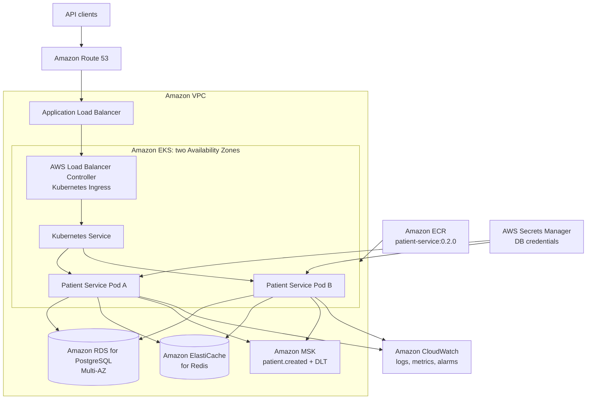

# Patient Service — AWS Design

## Goal

Run the Patient Service on AWS with managed infrastructure for the database, cache, Kafka, image registry, secrets, networking, and observability.



## AWS service mapping

| Local/project component | AWS equivalent | Role |
| --- | --- | --- |
| Colima k3s | Amazon EKS | Managed Kubernetes control plane and workload orchestration. |
| Local Docker image | Amazon ECR | Private registry for immutable, versioned images. |
| Kubernetes Deployment | EKS Deployment | Runs at least two patient-service Pods and performs rolling updates. |
| `kubectl port-forward` | ALB + Kubernetes Ingress | Public HTTPS entry point and routing. |
| Local PostgreSQL | Amazon RDS for PostgreSQL | Managed relational database; production setup uses Multi-AZ. |
| Local Redis | Amazon ElastiCache for Redis | Managed cache with TTL-based patient entries. |
| Local Kafka | Amazon MSK | Managed Kafka brokers, `patient.created` topic, and DLT. |
| Kubernetes Secret / `.env.local` | AWS Secrets Manager | Stores DB credentials; Pods read them through least-privilege AWS identity. |
| Local application logs | Amazon CloudWatch | Centralized logs, metrics, dashboards, and alarms. |

## Release path

```text
Git commit
  -> CI runs tests
  -> build patient-service:<version>
  -> push image to ECR
  -> update Deployment image tag
  -> EKS rolling update
  -> new Pods pass readiness
  -> old Pods terminate gracefully
```

The EKS Deployment retains the current availability settings:

```yaml
replicas: 2
strategy:
  type: RollingUpdate
  rollingUpdate:
    maxUnavailable: 0
    maxSurge: 1
```

This ensures Kubernetes starts and verifies a new Pod before intentionally taking an old ready Pod out of service.

## Security and resilience baseline

- Place the EKS worker nodes and data services in private subnets.
- Keep the ALB public only when the API must be internet-facing.
- Give the service a dedicated Kubernetes ServiceAccount mapped to a least-privilege AWS Pod identity or IAM role.
- Allow that identity to read only the Patient Service secret.
- Use security groups to permit only the service Pods to connect to RDS, ElastiCache, and MSK.
- Spread service Pods across Availability Zones and retain the PodDisruptionBudget for voluntary maintenance events.
- Continue Flyway migrations from the application release process; do not let Hibernate alter the production schema automatically.

## Next implementation milestones

1. Create an AWS account structure, VPC, and ECR repository.
2. Publish the versioned application image to ECR.
3. Provision RDS PostgreSQL and migrate existing Flyway schema.
4. Provision ElastiCache and MSK, then replace the local connection values with AWS endpoints.
5. Create EKS and deploy the current Kubernetes manifests through CI/CD.
6. Configure an ALB Ingress, TLS certificate, DNS record, CloudWatch alarms, and backup/retention policies.
